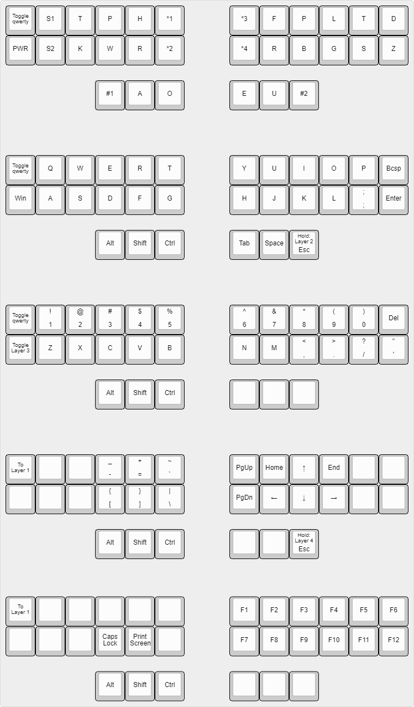

# georgi-custom

Custom firmware for the [Georgi](https://www.gboards.ca/product/georgi) keyboard

Changes to the main repo:
* deleted `sten.c` and `sten.h`
* deleted `processQwerty` in `keymap.c`

Layout:

